# Práctica 2 | Despliegue de Aplicaciones Web

M.ª Ángeles Buzón Campaña

## 00. Preparación

```bash
# Imagen para la práctica:
# Este comando crea el contenedor con nombre plesk con privilegios.
# También crea un volumen para la persistencia del contenedor
# y define los puertos que se van a usar.
# Por último se indica la imagen a cargar en el contenedor plesk/plesk.
docker run -d --name plesk --privileged --cgroupns=host -v /sys/fs/cgroup:/sys/fs/cgroup:rw -v plesk_data_fresh:/var/lib/plesk -p 666:80 -p 443:443 -p 8880:8880 -p 8443:8443 plesk/plesk

# Volver a levantar el contenedor:
docker start plesk
```


## 01. Despliegue de Plesk
Tardo en levantar el contenedor:
* Tenía abierto otro para un examen anterior del día.
* Tengo que eliminar el que ya había creado de plesk en un intento anterior y lo elimino con `sudo docker container remove plesk`.
* Por conflictos extraños, tengo que cambiar el puerto local `80` a `666` (reflejo esto en el comando de arriba).

Y al principio el navegador no lo muestra, pero es porque se estaba cargando. Puedo cargar la interfaz e iniciar sesión con las credenciales predeterminadas tanto en el puerto `8880` como en el `8443`:

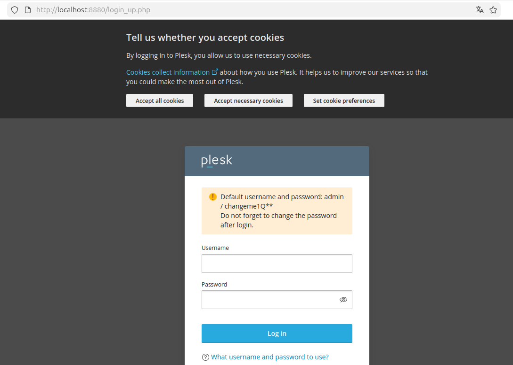
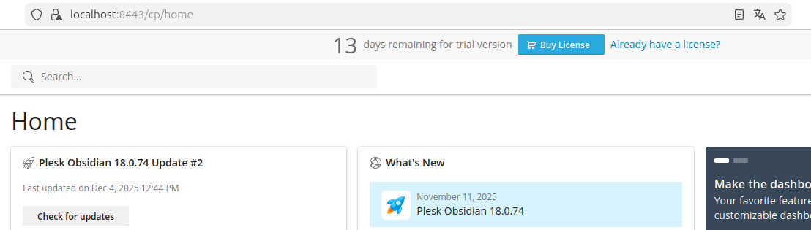

Si consulto los certificados, se están usando unos que ha creado Plesk automáticamente, pero el navegador sigue interpretando esta página como no segura. En un navegador Chromium puedo ver la info del certificado, que vence casi al mismo tiempo que se crea:

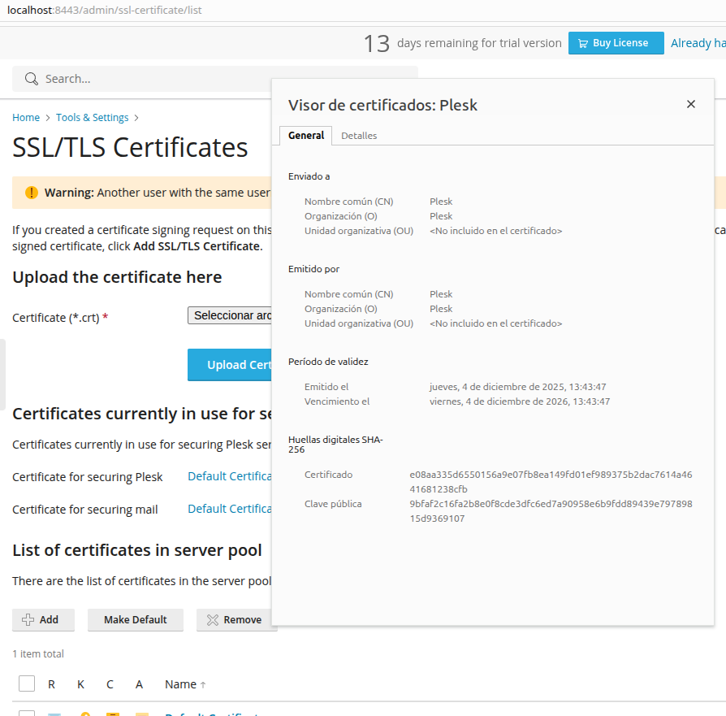

**¿Qué ventajas ofrece administrar un servidor web desde Plesk en vez de línea de comandos?**

Su interfaz gráfica es más intuitiva y fácil de usar que la CLI incluso para usuarios expertos y ofrece fácil acceso a secciones específicas para gestionar el servidor en general, automatizar tareas técnicas y optimizar el rendimiento. Además, tiene disponible una gran variedad de plugins para ampliar la funcionalidad.

## 02. Administración básica
Voy a `Home > Tools & Settings > Action Log Settings` y puedo descargarme un log perteneciente a un periodo de tiempo concreto.
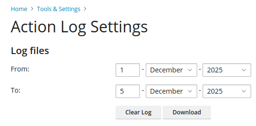

Recibo el archivo `log_from_2025-12-01_to_2025-12-05.txt`, donde hay registros de cuando se creó el servidor Plesk: login, actualización de datos...

```
127.0.0.1 admin [2025-12-04 12:43:37.812] 'Server cloning start' ()
127.0.0.1 admin [2025-12-04 12:43:51.382] 'Update IP Address' ('Interface': 'eth0' => 'eth0', 'IP Address': '172.17.0.3' => '172.17.0.3', 'IP Mask': '255.255.0.0' => '255.255.0.0')
127.0.0.1 admin [2025-12-04 12:44:00.530] 'SSL/TLS certificate on mail server assigned/unassigned' ('SSL Certificate Binding Type': 'MAIL' => 'MAIL', 'SSL Certificate File': 'cert1tLm1d2' => 'scf2m7vuo5poprmeIn1nON', 'SSL Certificate Id': '2' => '3', 'SSL Certificate Name': 'default certificate' => 'Default Certificate')
127.0.0.1 admin [2025-12-04 12:44:02.730] 'Update IP Address' ('Interface': 'eth0' => 'eth0', 'IP Address': '172.17.0.3' => '172.17.0.2', 'IP Mask': '255.255.0.0' => '255.255.0.0')
127.0.0.1 admin [2025-12-04 12:44:26.819] 'Update Administrator Information' ('Client GUID': 'f795477c-d10e-11f0-9b7e-82ce577a02ab' => 'f795477c-d10e-11f0-9b7e-82ce577a02ab', 'Login Name': 'admin' => 'admin', 'Password': '++++++' => '++++++')
127.0.0.1 admin [2025-12-04 12:44:38.110] 'Server cloning complete' ()
127.0.0.1 admin [2025-12-04 12:44:41.084] 'Update Administrator Information' ('Client GUID': 'f795477c-d10e-11f0-9b7e-82ce577a02ab' => 'f795477c-d10e-11f0-9b7e-82ce577a02ab', 'Login Name': 'admin' => 'admin', 'Password': '++++++' => '++++++')
172.17.0.1 admin [2025-12-04 12:52:15.526] 'CP User Login' ('Contact Name': '' => 'Administrator')
172.17.0.1 admin [2025-12-04 13:02:49.450] 'CP User Login' ('Contact Name': '' => 'Administrator')
172.17.0.1 admin [2025-12-05 11:34:20.381] 'CP User Login' ('Contact Name': '' => 'Administrator')
```

En las subsecciones `Tools & Resources` y `Server Management` también puedo acceder a información variada sobre los recursos del servidor. Por ejemplo, en `Info and Statistics`:

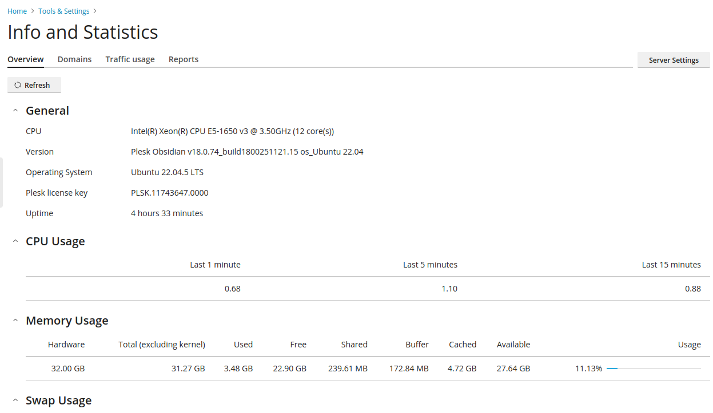

**Explica por qué es importante monitorizar estos parámetros.**

Es importante para poder llevar un seguimiento, como con todo. Permite detectar errores, fallos de seguridad y problemas de rendimiento en el momento en que pasan, o por lo menos llevar un registro que poder consultar después. De esta manera, es más fácil garantizar la estabilidad del sistema y decidir cuál es la mejor forma de optimizar y mantener el servidor.

## 03. Instalación de extensiones
Primero instalo **Firewall**, que protege el servidor de ataques controlando el acceso a los servicios mediante la configuración de reglas y políticas.


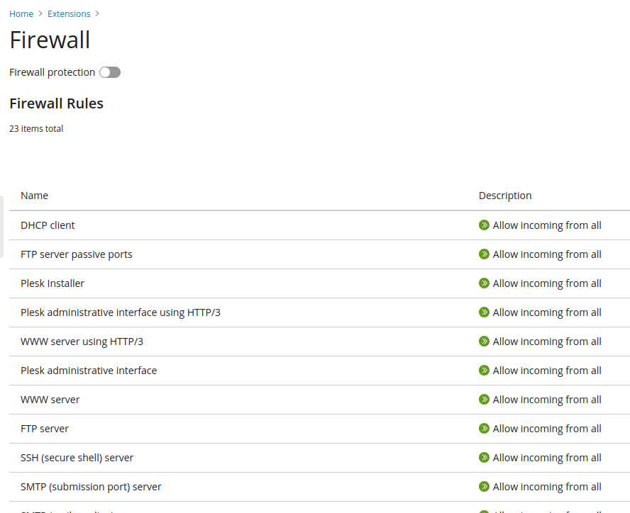

El sistema de búsqueda no encuentra Fail2Ban (luego me doy cuenta de que está ya integrado en Plesk), así que procedo a instalar **SEO Toolkit**, que ayuda a posicionar la web en los motores de búsqueda; permite hacer auditorías para detectar problemas comunes relacionados con el SEO, analizar archivos de registro y rastrear el rendimiento de las palabras clave.


En la configuración no se puede hacer nada porque hay que añadir un dominio primero.

**¿Qué riesgos tiene no contar con un sistema de protección adicional?**

Supone exponer el servidor al acceso no autorizado de terceros, más o menos malintencionados, como cuando no se pone el candado en una puerta. En los peores casos esto puede implicar sufrir ataques de fuerza bruta o la introducción de malware, lo que a su vez puede hacer que se caiga la web, se pierdan datos o lo contrario, que se extraigan datos como puede ser la información personal de los usuarios.


## 04. Creación de dominios
Creo un nuevo dominio (uno que me ofrece Plesk porque no tengo ninguno comprado) y sustituyo el `index.html` creado de forma predeterminada por un `index.php` muy sencillo.

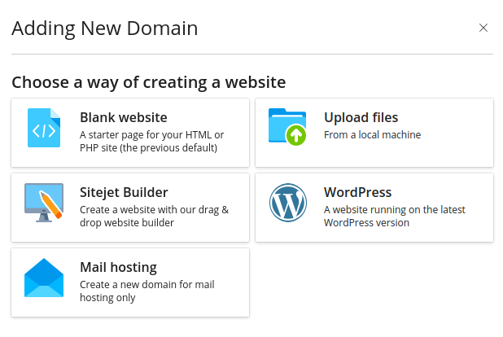

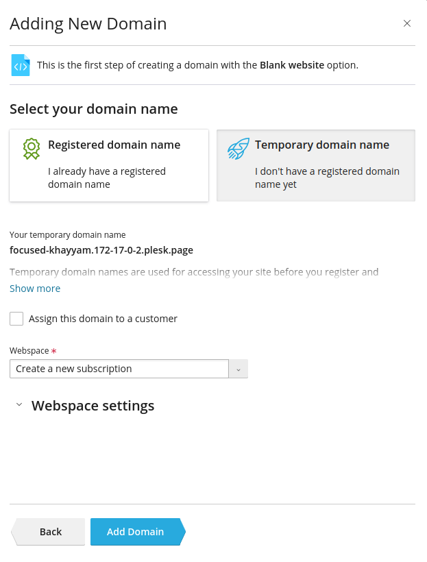

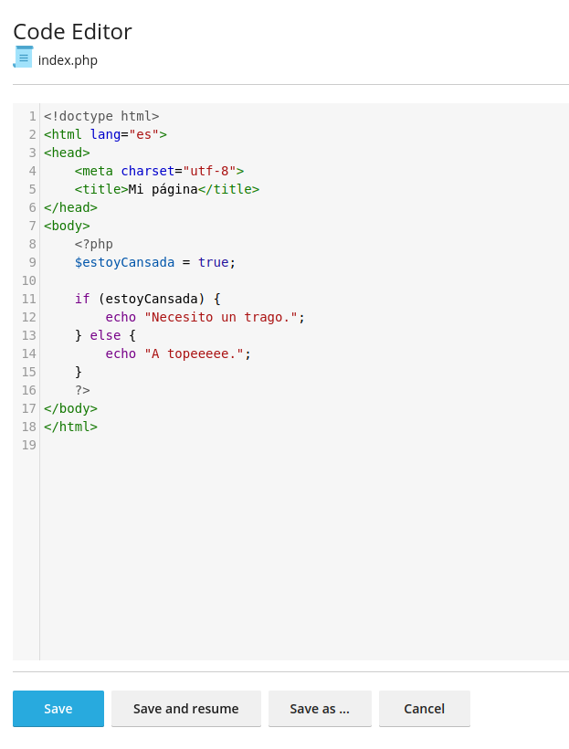

Si intento acceder al dominio, no puedo porque el certificado autofirmado no es seguro.
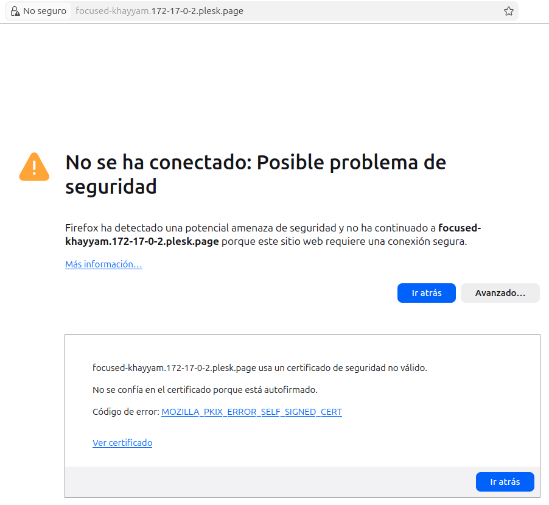

Pero al menos aparece como activo en el listado:

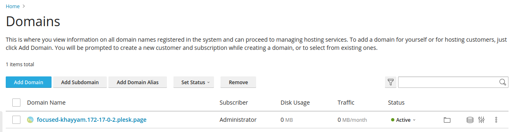

**¿Por qué es útil segmentar webs en vhosts en lugar de alojarlas juntas?**

Porque garantiza el aislamiento entre ellas, de manera que cada web tenga su espacio, sus permisos, su configuración, etc. Esto a su vez hace que la arquitectura del servidor sea más segura. Por ejemplo, si una de las webs es atacada a través de una vulnerabilidad en el código y no estuviera aislada, el atacante podría moverse con facilidad por los directorios y acceder también a las demás webs. También tiene ventajas de cara a la administración, ya que con una estructura limpia y separada es más fácil localizar archivos y desplegar y eliminar servicios. Además, cada web puede tener su propio software; por ejemplo, que cada una use versiones diferentes de PHP, o que cada una tenga su certificado SSL/TLS.

## 05. Autenticación y control de acceso
Me voy al panel de control de mi dominio `focused-khayyam.172-17-0-2.plesk.page` y luego a la sección `Security > Password-Protected Directories`.

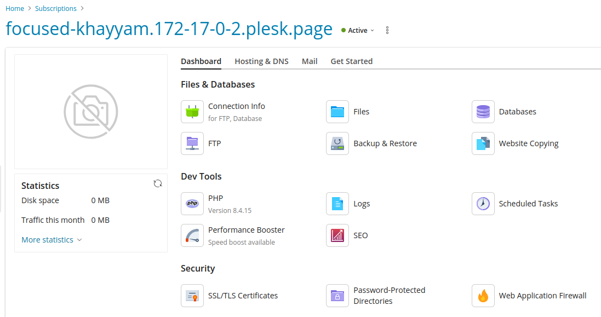

Le doy al botón de añadir carpeta con contraseña y añado una llamada `secreto`.

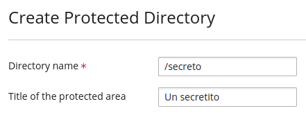

Ahora veamos los jails. Un jail es un conjunto de reglas específico de los configurables en el sistema de prevención de intrusiones de Fail2Ban. Monitoriza logs del servidor para detectar intentos de inicio de sesión fallidos o patrones de acceso maliciosos; si los detecta, automáticamente impide que la dirección IP del supuesto atacante acceda al servidor por un tiempo determinado. Es decir, sirve para proteger el servidor de ataques de fuerza bruta.

Ahora comentamos algunas jails preconfiguradas de Plesk:

1. `plesk-one-week-ban`: bloquea durante una semana direcciones de IP que se hayan baneado manualmente.
2. `plesk-wordpress`: escanea en busca de fallos de autenticación de Wordpress.
3. `ssh`: escanea en busca de fallos de autenticación de SSH.

**¿Por qué son los jails importantes? ¿Se te ocurre algún jail propio?**

Son importantes porque son una medida de seguridad básica para evitar ataques de fuerza bruta, en los que un bot intenta adivinar credenciales de acceso a SSH, FTP o paneles de administración, de manera que el atacante pueda tomar control del servidor, instalar backdoors o modificar datos.

Un jail adicional podría ser configurar el bloqueo de direcciones IP que accedan a una URL en concreto que se considere privada o de uso solo interno, configurando también una lista blanca de excepciones.

## 06. Certificado digital
Antes de nada, instalo las extensiones Let's Encrypt y SSL It!, necesarias para instalar un certificado de este tipo.

Let's Encrypt me dice "Plesk now issues SSL/TLS certificates only via the SSL It! extension", así que me voy a esa otra extensión, que me lista los dominios que tengo y sus certificados. Le doy clic a `focused-khayyam.172-17-0-2.plesk.page` para configurarlo.

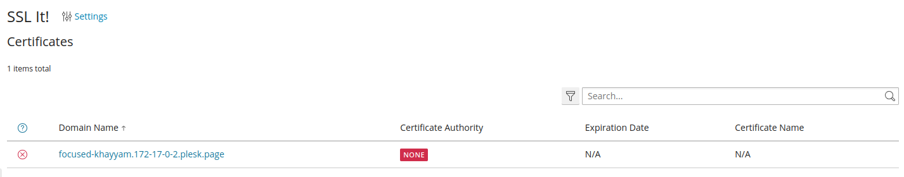

Entre las opciones disponibles, selecciono `Install a free basic certificate provided by Let's Encrypt` y dejo las opciones predeterminadas; como no tengo dominio propio, me va a dar error siempre, aunque use un email real y no el de `@example.com`, pero dejo constancia de cómo se hace.

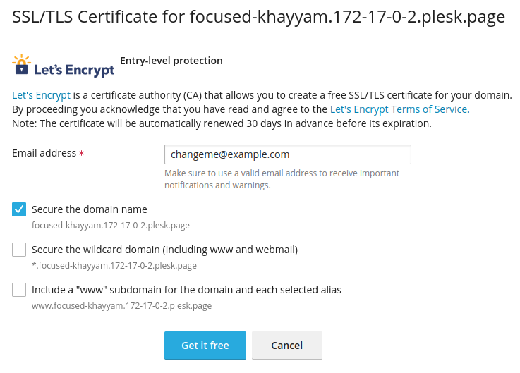

Si intento acceder a `https://localhost:8443` puedo iniciar sesión y navegar por Plesk sin problema, pero el acceso a `https://localhost:8880` es imposible por el error que da SSL.

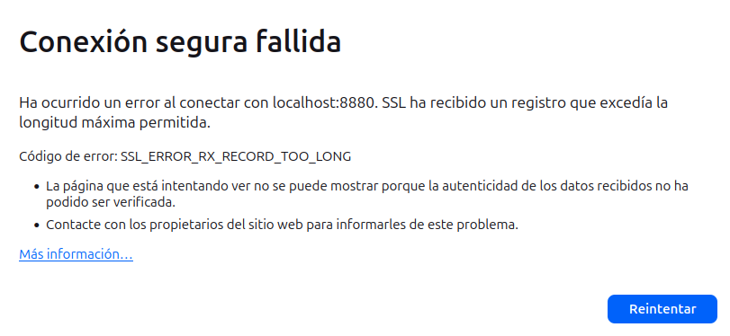

**¿Qué riesgos existen si seguimos usando HTTP en lugar de HTTPS?**

La comunicación de datos no es cifrada y queda expuesta a terceros, que pueden interceptarla o modificarla de manera malintencionada. Algunos de estos datos pueden ser bastante sensibles, como contraseñas o información personal introducida en formularios. Además, cuando los navegadores no encuentra un certificado HTTPS válido, marcan el sitio HTTP como no seguro, lo cual da problemas para acceder al sitio web desde el punto de vista técnico, reduce la confianza del usuario y perjudica el posicionamiento en buscadores.

## 07. Rendimiento
Compruebo los paquetes de Ubuntu y ab ya está instalado, así que procedo a intentar hacer las pruebas. Me da problemas porque no caigo en añadir la `/` final que indica la ruta raíz de la web. Una vez que lo hago, ya sí hace la prueba de rendimiento. Hago cuatro con diferentes parámetros:

```bash
# Prueba 1: 1000 peticiones, 50 concurrentes
usua5pc5@A5PC5:~$ ab -n 1000 -c 50 http://focused-khayyam.172-17-0-2.plesk.page/
This is ApacheBench, Version 2.3 <$Revision: 1903618 $>
Copyright 1996 Adam Twiss, Zeus Technology Ltd, http://www.zeustech.net/
Licensed to The Apache Software Foundation, http://www.apache.org/

Benchmarking focused-khayyam.172-17-0-2.plesk.page (be patient)
Completed 100 requests
Completed 200 requests
Completed 300 requests
Completed 400 requests
Completed 500 requests
Completed 600 requests
Completed 700 requests
Completed 800 requests
Completed 900 requests
Completed 1000 requests
Finished 1000 requests


Server Software:        Apache/2.4.58
Server Hostname:        focused-khayyam.172-17-0-2.plesk.page
Server Port:            80

Document Path:          /
Document Length:        10671 bytes

Concurrency Level:      50
Time taken for tests:   0.099 seconds
Complete requests:      1000
Failed requests:        0
Total transferred:      10945000 bytes
HTML transferred:       10671000 bytes
Requests per second:    10126.79 [#/sec] (mean)
Time per request:       4.937 [ms] (mean)
Time per request:       0.099 [ms] (mean, across all concurrent requests)
Transfer rate:          108239.93 [Kbytes/sec] received

Connection Times (ms)
              min  mean[+/-sd] median   max
Connect:        0    0   0.4      0       2
Processing:     1    4   0.6      4       7
Waiting:        0    4   0.6      4       6
Total:          3    5   0.6      5       8

Percentage of the requests served within a certain time (ms)
  50%      5
  66%      5
  75%      5
  80%      5
  90%      6
  95%      6
  98%      6
  99%      7
 100%      8 (longest request)

# Prueba 2: 100 peticiones, 80 concurrentes
usua5pc5@A5PC5:~$ ab -n 100 -c 80 http://focused-khayyam.172-17-0-2.plesk.page/

Benchmarking focused-khayyam.172-17-0-2.plesk.page (be patient).....done


Server Software:        Apache/2.4.58
Server Hostname:        focused-khayyam.172-17-0-2.plesk.page
Server Port:            80

Document Path:          /
Document Length:        10671 bytes

Concurrency Level:      80
Time taken for tests:   0.017 seconds
Complete requests:      100
Failed requests:        0
Total transferred:      1094500 bytes
HTML transferred:       1067100 bytes
Requests per second:    5813.95 [#/sec] (mean)
Time per request:       13.760 [ms] (mean)
Time per request:       0.172 [ms] (mean, across all concurrent requests)
Transfer rate:          62142.31 [Kbytes/sec] received

Connection Times (ms)
              min  mean[+/-sd] median   max
Connect:        0    4   1.9      4       6
Processing:     3    6   1.0      6       9
Waiting:        0    5   1.1      6       7
Total:          5    9   1.8     10      11

Percentage of the requests served within a certain time (ms)
  50%     10
  66%     10
  75%     10
  80%     10
  90%     11
  95%     11
  98%     11
  99%     11
 100%     11 (longest request)

# Prueba 3: 3 peticiones, 2 concurrentes
# Esta, al ser tan cortita, da resultados no válidos en la media/mediana de respuesta
usua5pc5@A5PC5:~$ ab -n 3 -c 2 http://focused-khayyam.172-17-0-2.plesk.page/

Benchmarking focused-khayyam.172-17-0-2.plesk.page (be patient).....done


Server Software:        Apache/2.4.58
Server Hostname:        focused-khayyam.172-17-0-2.plesk.page
Server Port:            80

Document Path:          /
Document Length:        10671 bytes

Concurrency Level:      2
Time taken for tests:   0.001 seconds
Complete requests:      3
Failed requests:        0
Total transferred:      32835 bytes
HTML transferred:       32013 bytes
Requests per second:    2808.99 [#/sec] (mean)
Time per request:       0.712 [ms] (mean)
Time per request:       0.356 [ms] (mean, across all concurrent requests)
Transfer rate:          30023.81 [Kbytes/sec] received

Connection Times (ms)
              min  mean[+/-sd] median   max
Connect:        0    0   0.0      0       0
Processing:     0    0   0.0      0       0
Waiting:        0    0   0.0      0       0
Total:          0    0   0.1      1       1
ERROR: The median and mean for the total time are more than twice the standard deviation apart. These results are NOT reliable.

Percentage of the requests served within a certain time (ms)
  50%      0
  66%      0
  75%      1
  80%      1
  90%      1
  95%      1
  98%      1
  99%      1
 100%      1 (longest request)

# Prueba 4: 5000 peticiones, 1000 concurrentes
usua5pc5@A5PC5:~$ ab -n 5000 -c 1000 http://focused-khayyam.172-17-0-2.plesk.page/

Benchmarking focused-khayyam.172-17-0-2.plesk.page (be patient)
Completed 500 requests
Completed 1000 requests
Completed 1500 requests
Completed 2000 requests
Completed 2500 requests
Completed 3000 requests
Completed 3500 requests
Completed 4000 requests
Completed 4500 requests
Completed 5000 requests
Finished 5000 requests


Server Software:        Apache/2.4.58
Server Hostname:        focused-khayyam.172-17-0-2.plesk.page
Server Port:            80

Document Path:          /
Document Length:        10671 bytes

Concurrency Level:      1000
Time taken for tests:   0.482 seconds
Complete requests:      5000
Failed requests:        0
Total transferred:      54725000 bytes
HTML transferred:       53355000 bytes
Requests per second:    10363.79 [#/sec] (mean)
Time per request:       96.490 [ms] (mean)
Time per request:       0.096 [ms] (mean, across all concurrent requests)
Transfer rate:          110773.12 [Kbytes/sec] received

Connection Times (ms)
              min  mean[+/-sd] median   max
Connect:        0    5  10.4      0      41
Processing:     5   73 114.4     38     437
Waiting:        0   73 114.4     38     437
Total:         24   78 122.9     39     461

Percentage of the requests served within a certain time (ms)
  50%     39
  66%     41
  75%     41
  80%     42
  90%     93
  95%    457
  98%    459
  99%    460
 100%    461 (longest request)
 ``` 

**¿Qué factores influyen en el rendimiento de un servidor web?**

El rendimiento de un servidor web depende de varios factores:

* Los recursos de hardware (CPU, RAM, almacenamiento en disco).
* La configuración del servidor (si se usa Apache o Nginx según el proyecto, la versión y configuración de PHP, el uso de sistemas de caché).
* El número de peticiones concurrentes y la carga de tráfico.
* La optimización de las aplicaciones en sí y de las consultas a las bases de datos.


## 08. Despliegue de aplicaciones
No puedo añadir más de un dominio en la versión gratuita, pero sí subdominios al que ya tengo, así que eso hago: creo el subdominio `wp`.

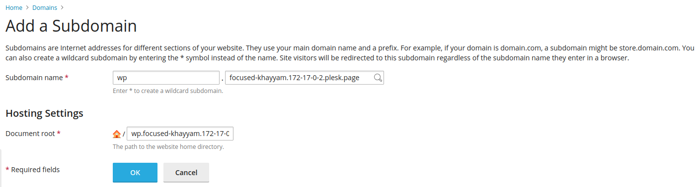

Luego me lleva directamente al panel de control del subdominio y le doy al botón de instalación de Wordpress, y configuro los ajustes.

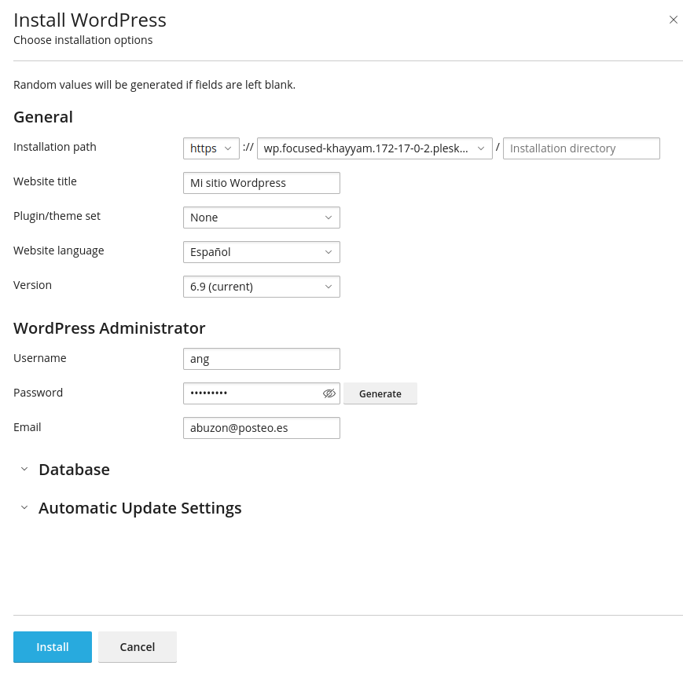

Por una vez, se instala todo bien.

Para comprobar la seguridad de Wordpress, me voy al panel de control de mi sitio Wordpress y le doy a la opción `More > Check Security`. Le doy a la opción de `Check Security`, tarda un poquito y vuelve a decir que está todo bien, pero me da recomendaciones de cosas que instalar y hacer para mejorarla.

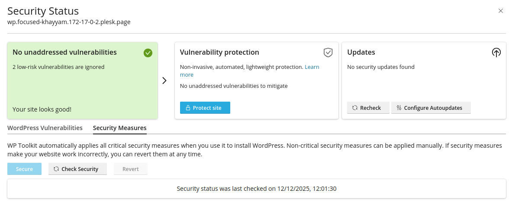

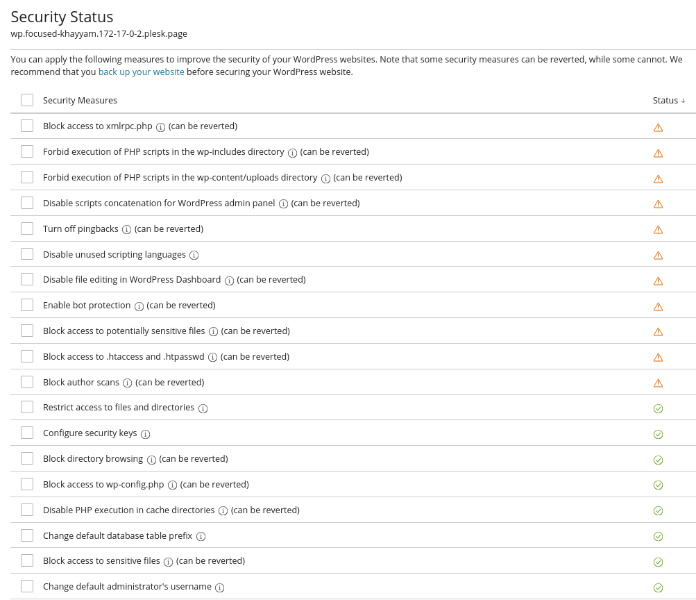

Si intento acceder a la URL de login en Wordpress, me da error. Puedo intentar instalar un certificado en este subdominio, pero pasará lo mismo que en el dominio raíz porque no es un dominio propio.

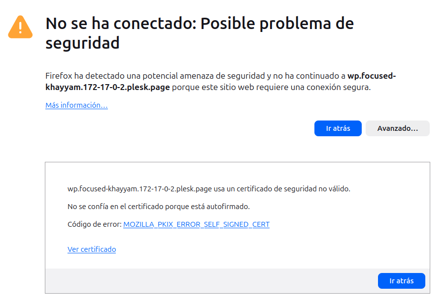

Descubro con el profesor que esto puede deberse a haber creado al principio un dominio temporal de Plesk en lugar de uno registrado propio (aunque sea inventado y de uso solo local). Elimino los anteriores, creo `miweb.local` y ahora al acceder a `https://miweb.local` sí me da la opción de acceder de todas maneras aunque no tenga un certificado como tal.

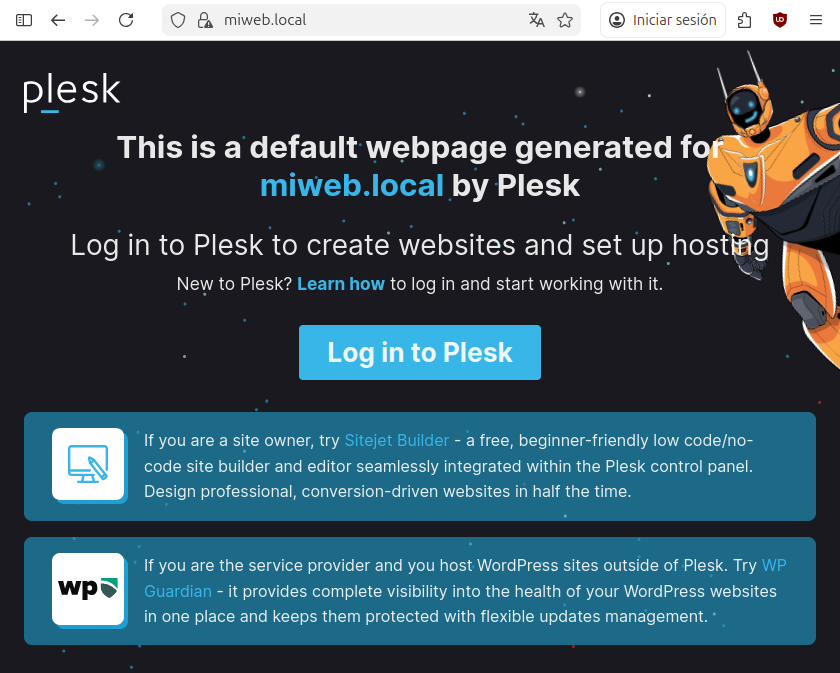

Si instalo Wordpress en `/wp/`, esta vez sí puedo acceder a la interfaz de login y me inicia sesión automáticamente.

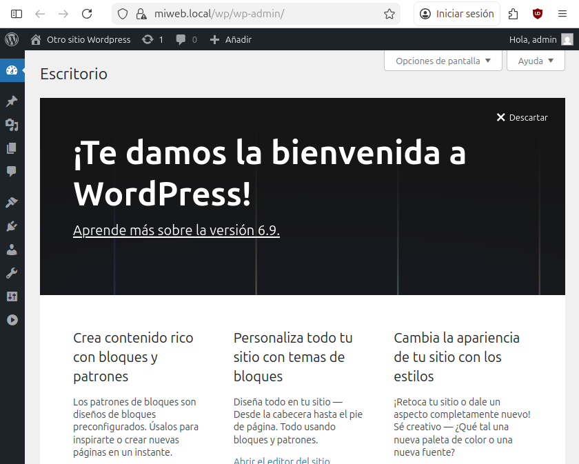

Para personalizar un poco la página, publico una entrada nueva aparte de la de "Hola mundo".


Para comprobar la conexión de WordPress a la base de datos, accedo al archivo `/wp/wp-config.php` en el administrador de archivos del dominio en Plesk y verifico que los datos de conexión (`DB_NAME`, `DB_USER` y `DB_HOST` coinciden exactamente con los datos del panel de Plesk, que usa la interfaz de PhpMyAdmin.

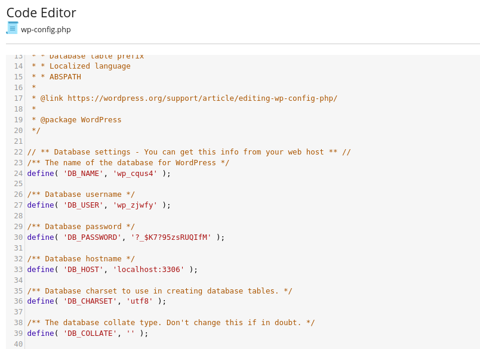

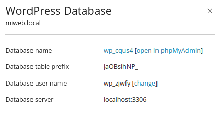

Puedo acceder a los logs de WordPress desde el panel de control del dominio.

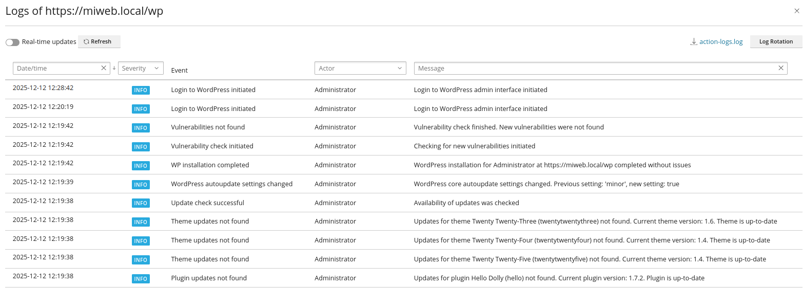

**¿Qué es WordPress? ¿Se usa hoy en día? ¿Tú lo usarías?**

Wordpress es un sistema de gestión de contenidos (CMS) que se concibió originalmente para la creación de blogs, pero actualmente es la tecnología para crear páginas web en general más utilizada en el mercado. De hecho, casi la mitad de todas las webs del mundo utilizan Wordpress, más del 43% según datos de mayo de 2025 [(fuente)](https://wordpress.com/es/blog/2025/05/08/wordpress-estadisticas-cuota-de-mercado-y-mucho-mas/).

No conozco Wordpress lo suficiente como para tener una opinión fundamentada, pero hay que tener en cuenta que el que sea el CMS más extendido no significa que sea el más apropiado siempre. Puede que sea útil para montar la web de pequeños clientes que necesiten poder gestionar ellos mismos los contenidos de un sitio web poco complejo de una manera sencilla. En cualquier caso, sí me parece útil conocerlo y saber utilizarlo como programador aunque sea por la cuota de mercado que representa.